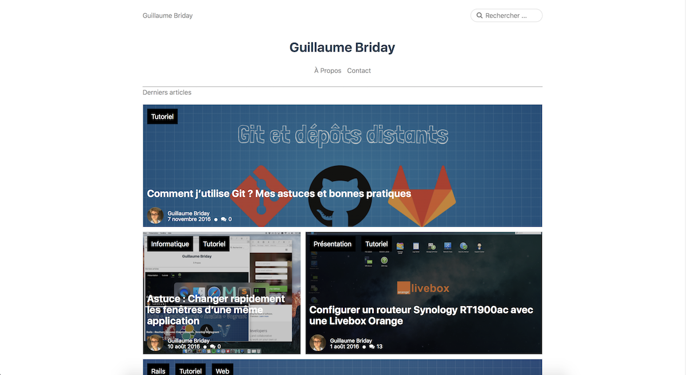
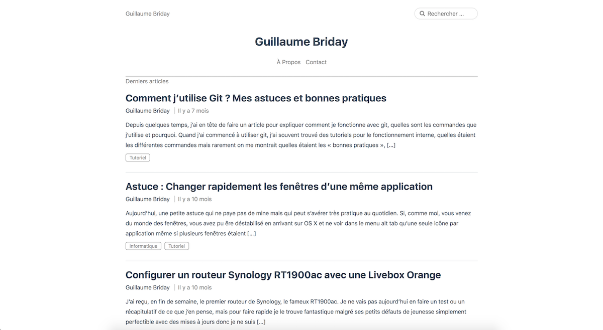

# Worpdress-Minium-Theme
Un thème minimaliste pour Wordpress.


*Thème en grille*


*Thème en ligne*

## Fonctionnalités

Le thème supporte 2 layouts differents que vous pouvez modifier à la volée dans le menu de personnalisation du thème.

## Installation

Le thème est prêt à être utilisé, vous pouvez dès maintenant le télécharger et l'installer sur Wordpress.

Il est conseillé de mettre une image de couverture pour chaque articles et chaque pages.

Pour ajouter des icônes vers différents sites, il vous faudra créer un menu, puis le rattacher au "Menu Social" prévu à cet effet. Rajoutez ensuite des liens personnalités vers les différents sites de votre choix, les icônes se mettront automatiquement en place en fonction du lien.

Les icônes sont actuellement disponible pour : Twitter, Codepen, Dribbble, Dropbox, Facebook, Flickr, Foursquare, Github, Instagram, Linkedin, Pinterest, Reddit, Skype, Tumblr, Vimeo, Wordpress, Youtube, Twitch, Spotify, Google +, Un flux RSS, Un lien vers un mail.

Il est par ailleurs très conseillé d'utiliser un nombre pair d'articles par page, car le thème ne gère pas encore très correctement le cas inverse. Il y aura, simplement, un espace vide à la fin dans le cas d'un nombre impair.

## Personnalisation

Le thème est également fourni avec le code source du style.

Pour installer les dépendances, yarn et bower doivent être installé sur votre poste et vous devrez utiliser la commande :

```
$ yarn install
```

Une fois vos changement effectués dans le dossier /assets/scss vous pourrez les compiler avec la commande :

```
$ gulp styles
```

Le code sera alors parsé, minifié et autoprefixer, inutile donc de le faire à la main.

## Suggestions

N'hésitez pas à me faire des retours d'améliorations pour ce thème que je rajouterais au besoin.
